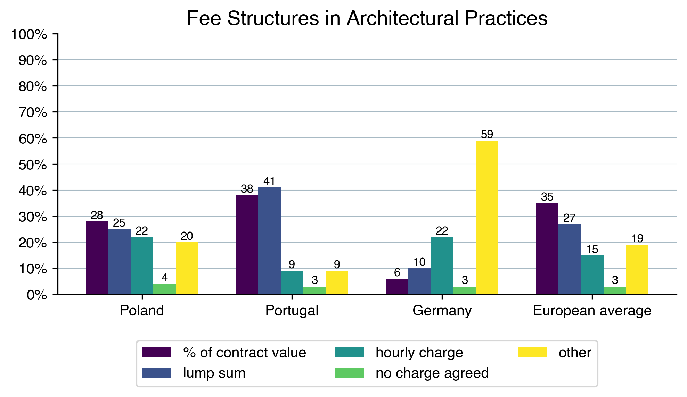
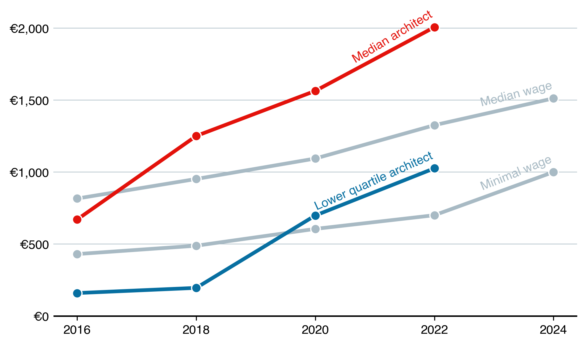
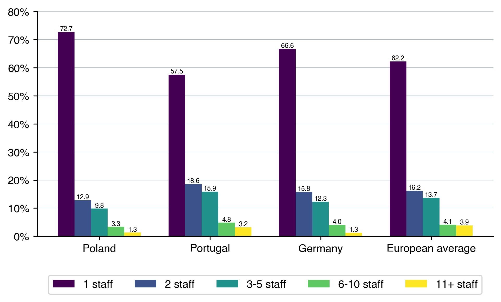
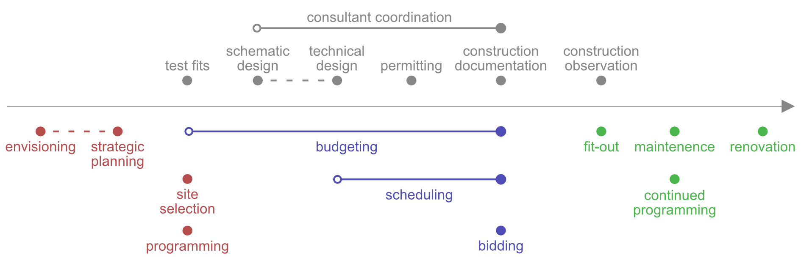
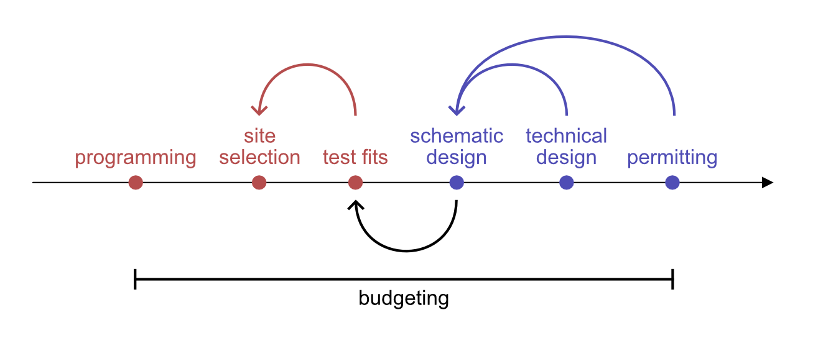

# Part I: Theory

## Aim

`revise based on gaps in state-of-the-art and research questions`

This thesis aims to establish a competitive and sustainable business model for sole-proprietor architectural practices.

## Relevance

### The business model of architecture

Architectural firms are small and medium enterprises that provide professional architectural services. The core of these services involves translating client needs and regulatory requirements into functional, aesthetic, and durable designs. Frequently, architects' services create societal value for stakeholders other than the client, such as the local community, environment, and users. To deliver these services, a firm usually employs architects who collaborate to create design solutions (Scharphie, 2014).

Most practices have a simple revenue model that converts a fee agreed in the contract to the time of architects that is billed to the project, with leftover sum forming the operating profit on net revenue (Bernstein, 2018). The business model of architecture has some unique characteristics in comparison to other professional services. First, as the work is project-based, the value proposition changes from project to project, depending on the client and the role in the project. Second, not only is the use value subjective and uncertain upfront, but also it is often co-created with stakeholders. Moreover, the use value of different stakeholders can be contradicting, leading to value conflicts that have to be resolved by the architect. Third, some of the value is captured as professional value (e.g. reputation, work pleasure) rather than monetary value and architects are often found to maximize professional value at the expense of income or even use value for the client (Bos-de Vos, 2022).

Following is the description of the most common revenue models in architectural practice in selected European markets.

### Revenue

Architectural fees are the primary source of revenue for a practice. The fee structure varies across countries. In Poland, the fees are typically structured as either fixed charge (53%, with around half calculated as a percent of contract value, and the other half as a lump sum) or hourly charge (22%) (ACE, 2022).

To increase revenue, architectural firms typically hire more architects to take on larger and more numerous projects. This ties the revenue to employment and for a given productivity level, the more architects work for a firm the greater its revenue (ACE, 2022).

Revenues per practice size in select European markets:
| Country | 1 staff | 2 staff | 3-5 staff | 6-10 staff | 11-30 staff |
| --- | --- | --- | --- | --- | --- |
| Poland | €25,256 | €33,128 | €144,394 | €208,145 | €387,454 |
| Portugal | €24,416 | €46,214 | €134,954 | €260,457 | €1,223,018 |
| Germany | €87,259 | €153,273 | €301,210 | €622,718 | €1,490,366 |
| European average | €63,073 | €111,809 | €237,039 | €522,804 | €1,410,682 |

### Expenses

Labor costs dominate the expenses of an architectural practice, with salaries and benefits often accounting for over 90% of total costs (Unger, 2018). In Poland, controlling labor cost becomes harder as the economy reaches advanced status and transitions away from competing with cheap labor. Since 2016, median wages in the private sector have increased by 85.3%, significantly outpacing the cumulative inflation of 56.7%. Given the positive economic outlook and a shrinking labor force, Polish labor costs are likely to continue rising (Piątkowski, 2023).

The rising wages in general economy increase the opportunity cost of being an architect. This creates two effects: salaried architects demand higher wages, and top professionals leave for other industries when these demands are not met. Notably, due to the robust growth of the construction market and a low starting point, the median pay for architects has outpaced the national median (ACE, 2022 and GUS, 2024).

### Profitability

Rising labor costs have an adverse effect on the profitability of architectural practices. Moreover, negotiating higher fees is challenging in Poland's highly competitive architectural market. With approximately 5,070 architectural practices competing for a market worth €335 million, the average revenue rounds up to €66,000 per practice (ACE, 2022).

However, 72.7% of these practices have a single architect on staff, and the competition drives down the revenue in that segment of the market to only €25,256 per practice (ACE, 2022). This makes it difficult for small firms to pass rising costs onto clients and constrains their profit potential.

Given the compensation model and cost structure, profitability in architectural firms is often challenging. The labor-intensive nature of architectural work, combined with high competition and rising labor costs, can lead to tight margins, particularly for smaller practices. Additionally, smaller firms often have limited revenue backlogs, making low operating margins a more severe threat to their financial stability (Deltek, 2024). 

### Outlook for the profession

Running an architecture business carries significant risk. Architectural firms oversee large and complicated projects, they often have a weaker position in contract negotiations and they depend on a wide array of consultants to complete projects (Unger, 2018). Moreover, their services carry professional liability, which can lead to costly lawsuits years after project completion (Bernstein, 2018). A higher risk profile demands higher margins to shelter businesses from liabilities, cash flow problems, and financial downturns.

As competition and labor market applies additional pressure on the margins of small architectural practices, their economic viability is questioned. Firms habitually earning less then the free-market return (long-term yield on goverment securities adjusted for risk of losing capital) will eventually go out of business (Porter, 1998). If external and internal pressures persist, the architectural services in Poland will likely consolidate, as only larger companies will be able to compete in a highly cyclical, commoditized market. In the United States, where a wave of mergers and acquisitions has already occurred in the architecture sector, consolidation led to improved cost management and operating margin raising to the average of 18% (Deltek, 2024). While beneficial for efficiency, market consolidation raises concerns for the future of architecture as a liberal profession (EESC, 2017).

## Strategies for improving competitiveness

Given the market outlook, establising a competitive business model for sole-proprietor architectural practices is essential for their survival. Strategies for coping with competitive forces were categorized in a seminal work by Porter (1998) into three generic categories:

- Overall cost leadership - achieved by economies of scale and aggressive cost control
- Differentiation - creating a perception of industry-wide unique service through brand, technology, customer experience etc.
- Focus - targeting a particular buyer, segment or geographic market and serving them exceptionally well

Porter argues that implementing a competitive strategy requires full organizational commitment and therefore only one strategy should be formulated and pursued. Whether or not they explicitly formulate a competitive strategy, architectural firms implement a common mix of tactics to improve their competitiveness.

### Tactics for architectural practices

In the context of architectural practice, firms can implement following tactics to improve their financial performance (Unger, 2018):

1. **Scale up** - Attract more clients and projects to boost overall revenue.
2. **Specialize** - Increase pricing power by offering a unique value proposition.
3. **Reduce costs** - Streamline operations and manage expenses, particularly labor costs.
4. **Offer new services** - Develop additional revenue streams through complementary services.
5. **Enhance labor productivity** - Implement efficient processes and technologies to increase output per employee.

#### 1. Scale up

Scaling up the operations can help spread the risk over many projects and ensure continued business, but is by definition challenging for small firms. The labor-intensity of architectural design requires significant investment in human resources which can be out of reach for sole-proprietor practices. Moreover, as argued earlier, increasing employment leads to proportional growth in both revenue and labor costs, which does not improve the margins.
 
One potential strategy for small firms to compete on a larger scale is to form consortia, allowing them to share resources and bring in more business without losing independence. In Poland, 34% of practices have a formal association with another practice, suggesting that cooperation is a popular strategy (ACE, 2022). In the Chinese construction market, network strategy that fostered collaboration with competitors, long-term commitment and sharing resources was found to significantly correlate with profitability of firms (Li and Ling, 2012).

However, in practice cooperation can be challenging due to differences in management styles and architects' attachment to individual creativity. Small firms may also lack the capacity to manage the additional burden of coordinating with others. A recent public competition illustrates these difficulties. Eleven small architecture firms formed a collective to compete for a large museum project, but the cooperation proved to be difficult. The collective produced three competing proposals, and two firms ultimately left the group. Ironically, one of these departing firms went on to win the competition individually, while only one collective proposal received recognition (Architektura & Biznes, 2022).

#### 2. Specialize

Specialization offers a promising avenue for small architectural practices to increase their pricing power. By focusing on a specific niche, firms can develop deep expertise, differentiate themselves from competitors, and potentially command higher fees. This tactic allows small practices to compete effectively against larger firms by offering specialized knowledge and services that may be outside the scope of generalist practice (Li and Ling, 2012).

Some notable niches that small architectural firms might consider include:

- **Luxury residential** - Catering to high-net-worth individuals with bespoke design services
- **Specialized facility architecture** - Designing complex environments for industrial, healthcare, and educational purposes
- **Adaptive reuse** - Repurposing buildings for new functions, often with historical preservation considerations
- **Mass timber design** - Specializing in sustainable wooden structures
- **Zero-energy design** - Focusing on ultra-energy-efficient buildings
- **Facade engineering** - Developing building envelopes for other architects
- **Architectural software development** - Creating tools to enhance the design and investment processes

#### 3. Reduce costs

The financial stability of small architectural firms heavily relies on controlling labor costs, but the competitive job market makes reducing costs challenging. Still, practices can consider alternative tactics such as outsourcing or flexible work arrangements.

Outsourcing to countries with cheaper labor markets, a common strategy in other professional services sectors like law and accounting, has a proven cost benefit. However, it presents unique challenges for small architecture firms. Differences in building regulations across countries make it difficult to find foreign expertise familiar with local requirements, and increase the effort required for quality assurance.

Flexible work arrangements with local freelancers offer a solution, allowing firms to pay only for the labor they need. This approach has gained popularity, particularly in the field of architectural visualization. However, as freelance designers can be unreliable for business-critical tasks and their costs are likely to rise with overall economic growth, this may not be a sustainable long-term strategy for maintaining competitiveness.

#### 4. Offer new services

Expanding services offers a compelling tactic for small architectural firms to enhance their competitiveness. By broadening their service offerings, these firms can create additional use value for clients, differentiate themselves from competitors, and create new revenue streams. This approach can be augmented by utilizing the rich design data produced in modern architectural practice to address a wider range of client needs throughout the building lifecycle (Bernstein, 2018).

Traditional architectural services typically include:
- Test fits and feasibility studies
- Schematic design
- Technical design
- Construction documentation
- Permitting assistance
- Construction observation

However, firms can significantly enhance their market position by offering additional services outside of the core architectural production phase:

- Pre-design services:
   - Envisioning workshops
   - Strategic planning (e.g., masterplanning, workplace strategy)
   - Programming and space requirement analysis
   - Site selection and evaluation
   - Preliminary budgeting and cost estimation
   - Project scheduling and timeline development

-  Post-design services:
   - Bidding and contractor selection assistance
   - Construction management
   - Interior design and fit-out services
   - Post-occupancy evaluation and continued programming
   - Facility maintenance planning
   - Renovation consulting

However, it is important to note that small firms may traditionally lack the capacity to offer such a wide range of services due to limited human resources. This is where the potential of automation in reducing labor requirements for core design tasks becomes crucial. By using technology to streamline their design processes, small firms can free up valuable resources. This newfound capacity can then be redirected towards developing and offering these expanded services, allowing small architectural practices to compete more effectively.

#### 5. Enhance labor productivity

The construction industry, including architectural services, has significantly lagged in productivity growth compared to other sectors. McKinsey Global Institute (2017) reports that while many industries have seen productivity gains up to 1,500% since the 1940s, construction productivity has stagnated. For small architectural practices, wishing to carve their place on the market, enhancing labor productivity is an essential tactic. Key ways to increase the output per hour worked include:

1. Training staff to enhance skills and knowledge
2. Improving work processes for greater efficiency
3. Investing in technology, particularly advanced automation tools

First, training staff to be more knowledgeable and efficient equips employees with the latest industry knowledge, software proficiency, and best practices. Well-trained staff can work faster, make fewer errors, and produce higher-quality outputs. Moreover, ongoing training can boost employee engagement and retention, contributing to overall productivity and reducing costly turnover (Unger, 2018).

Second, improving work processes can be particularly beneficial given the iterative nature of design work. Architecture involves cycles of refinement and revision, making it well suited for implementing adaptive processes. By introducing iterative workflows, firms can minimize work that has to be redone, reduce errors, and firmly include the client in the design process (Waszkiewicz, 2022). Additionally, facilitating smooth hand-offs between project phases through solid documentation and collaborative tools can significantly reduce time lost in transitions and improve overall productivity.

Third, investment in technology can further enhance labor productivity by automating routine tasks, improving information reliability and enabling iterative workflows (Bernstein, 2018). Moreover, the combination of data-rich modelling and computation has the potential to significantly reduce the labor intensity of the design process. Given the recent advances in these areas, advanced automation will be one of the core tactics explored in this thesis.

### Innovative business models in practice

To explore the application of competitive strategies in architectural practice, three firms operating in an innovative business model were analyzed.

#### 1. Ecologiq (Ekoinbud group)
Strategy: overall cost leadership

Client: public education (needs: easy procurement, low total cost (construction and maintenance), fast execution)

Value proposition: design & build, prefabricated modular timber construction (fast, low operating costs)

Expanded services: envisioning, programming, site selection, budgeting, bidding, construction, fit-out

Ecologiq is a daughter company of Ekoinbud group, a general contractor operating in the construction market since 1998. Under the Ecologiq brand, the company offers the design & build service for prefabricated timber construction. The main clients are public institutions that want to build educational facilities, for which Ecologiq completed over 50 nursery, kindergarten and school projects.

Ecologiq leverages their prefabricated timber technology to map directly onto the needs of public institutions. Public investors are constrained by strict procurement regulations and are often wary of completing the work during election cycles. They do not have the resources for construction management and as owners of the facilities they are sensitive to operating costs.

Ecologiq's value proposition is to offer a design & build contract and guarantee fast execution and low operating costs thanks to prefabricated timber technology. They offer a comprehensive service that is sought after by public clients and allows them to manage costs by full control over the design and fabrication process.

#### 2. Facit Technologies
Strategy: Differentiation

Client: private housing (needs: minimizing risk, unique design, fast execution)
Value proposition: on-site fabrication technology, turnkey service, cost certainty
Expanded services: programming, budgeting, construction, fit-out

#### 3. Maka.studio
Strategy: Focus

Client: medical facilities
Value proposition: medical design expertise, medical permitting assistance, medical technologist on staff
Expanded services: site selection, budgeting, construction management

Porter argues that choosing only one strategy and focusing all resources on it is the best way to gain a sustainable competitive advantage (Porter, 1998). Given the the small scale of sole-proprietor architectural firms, the focus strategy was chosen as the most relevant.

Choosing buyers with low bargaining power and switching cost, high growth potential, (przedszkole git, ale moze prywatny dom opieki ma wyzszy growth potential).

### Gaps in SotA = research problem
### hypothesis
### restate the aim

## Objectives

This thesis explores an alternative approach to run a sustainable architectural practice: transforming it from a
labor-intensive to a capital-intensive business model. This strategy aims to utilise the low cost of capital and
capitalise on the digital nature of architectural services. In essence, it involves minimising human labor in the design
process through technology and automation. A labor-lean practice would operate with a minimal workforce, focusing
on tasks that are either too complex or cost-prohibitive to automate or outsource.

To assess the potential of automation a list of services provided by architectural practice is evaluated. Every firm,
big or small, has to fill the three basic roles to operate (Unger, 2018):

1. Business development
2. Finance
3. Design

In a sole-proprietor firm, all three roles are often performed by the owner, while any additional hires work on parts
of the design process. Therefore, the strategy to establish a lean practice is to reduce the labor-intensity of the 
design process, eliminating the need for employment, and to automate or outsource non-client-facing operations. 
This shift allows the principal to focus on optimizing the financial structure, expanding the service offer, 
reaching new clients and building relationships with existing ones.

Business development and finance processes lay outside of the scope of this thesis and the following analysis will
focus on the design tasks.

### Automation potential assessment

To assess the high-level potential of automating or outsourcing the design processes, the ICE method is employed. This
project management technique helps establish a priority order for ideas, features, or tasks. The method involves
three key assessments:

1. Impact (I): How valuable is the task in terms of time, money, and client satisfaction?
   - 3: Required by law, contract, or crucial for building client relationships
   - 2: Upsell for client or improvement of internal processes
   - 1: Not billable to client or low-frequency internal task

2. Confidence (C): How strong is the evidence supporting the impact assessment?
   - 3: Required by law or a core part of the fee
   - 2: Good understanding of the process
   - 1: Based on assumptions

3. Ease (E): How easy is it to automate the task?
   - 3: Off-the-shelf software
   - 2: Custom tools and services required
   - 1: Personal, manual or otherwise not easily automated

For each process, these three factors are assessed on a scale of 1 (low) to 3 (high). The ICE score is then computed
by multiplying the three estimates: ICE Score = Impact × Confidence × Ease. Tasks with an ICE score lower than 5 are
discarded, while those scoring 5 or higher are kept for a detailed assessment.

In the following evaluation, the traditional architectural services are expanded to include additional pre-design
services. However, additional construction and occupancy services are omitted as they primarily deal with physical
processes and are therefore outside the scope of this thesis.

| Pre-design | Impact | Confidence | Ease | ICE score | Automate? |
| --- | --- | --- | --- | --- | --- |
| Envisioning | 3 | 1 | 1 | 3 | No |
| Strategic planning | 2 | 1 | 1 | 2 | No |
| Programming | 2 | 1 | 3 | <u>**6**</u> | Maybe |
| Site selection | 2 | 1 | 3 | <u>**6**</u> | Maybe |
| Test fits | 2 | 1 | 3 | <u>**6**</u> | Maybe |

| Design | Impact | Confidence | Ease | ICE score | Automate? |
| --- | --- | --- | --- | --- | --- |
| Schematic design | 3 | 1 | 3 | <u>**9**</u> | Maybe |
| Technical design | 3 | 2 | 2 | <u>**12**</u> | Yes |
| Permitting | 3 | 3 | 2 | <u>**18**</u> | Yes |
| Construction  documentation | 3 | 1 | 2 | <u>**6**</u> | Maybe |
| Budgeting | 2 | 1 | 3 | <u>**6**</u> | Maybe |
| Scheduling | 2 | 1 | 2 | 4 | No |
| Consultant  coordination | 2 | 2 | 1 | 4 | No |

Automation in architectural design may significantly reduce the cost of redoing work and enable an iterative workflow.
Computational efficiency allows for exploration and refinement of design concepts, leading to better-optimized designs
and enhanced client satisfaction through more responsive design development. 

On the other hand, it faces significant challenges. The primary concern is the bespoke nature of construction projects.
Unlike manufacturing, architecture deals predominantly with one-off designs. This characteristic poses an obstacle for
traditional automation methods, which excel at replacing repetitive tasks. 

Adapting automation to the diverse demands
of architectural design presents a complex challenge that this thesis will address. Following initial assessment, the
scope will be limited to the pre-design (programming, site selection, test fits) and design (schematic, technical,
permitting) phases. Additionally, iterative budgeting will be included in the scope, starting from the first step of the
workflow.

### Key objectives

To recap, the aim of the thesis is to establish a lean design process for sole-proprietor architectural practices by
automating labor-intensive tasks. The key objective are to:

- evaluate the potential of automation of a worfklow from programming to permitting
- enable product iteration within and across phases
- automate suitable processes using existing open-source and commercially available tools and develop new tools
when it is critical to bridge the workflow
- enable a sole architect to deliver a technically sufficient and aesthetically adequate design for a medium-sized
project
- perform an economic evaluation of the workflow

### Scope

`subject to change`

For the application the scope will be limited to: 

- polish architectural market and regulatory framework
- residential new-built projects of medium-size (under 10,000 sqm GFA)
- simple, regular plots under 5,000 sqm area without a local plan

# Part II: Practice

## Methods

## Results

## Discussion

## Outlook

# Bibliography

Architects' Council of Europe (2022) *The Architectural Profession in Europe 2022 Sector Study*.

Bernstein, P. (2018) *Architecture, Design, Data: Practice Competency in the Era of Computation*. 1st edition. Basel,
Switzerland: Birkhäuser.

*Czy czeka nas kolektywna przyszłość projektowania? – ruszył 14. Westival w Szczecinie* (2022) *Architektura i Biznes*.
Available at:
[https://www.architekturaibiznes.pl/14-westival-szczecin-przyszlosc-wystawa,11307.html](https://www.architekturaibiznes.pl/14-westival-szczecin-przyszlosc-wystawa,11307.html)
(Accessed: 13 October 2024).

Deltek (2024) *Clarity: Architecture & Engineering Industry Study*.

European Economic and Social Committee (2017) *Manifesto: Definitions of the concept of liberal profession at European
level*, *European Economic and Social Committee*. Available at:
[https://www.eesc.europa.eu/en/documents/manifesto-definitions-concept-liberal-profession-european-level](https://www.eesc.europa.eu/en/documents/manifesto-definitions-concept-liberal-profession-european-level)
(Accessed: 13 October 2024).

Kooij, J. van der (2023) *Revenue Architecture*. First Edition. Delaware: Winning by Design.

Piątkowski, M. (2023) *Złoty wiek: Jak Polska została europejskim liderem wzrostu i jaka czeka ją przyszłość*. Second
edition. Warszawa: Prześwity.

Scharphie, M. (2014) *Emerging Modes of Architecture Practice*. Northeastern University School of Architecture.

Unger, G. (2018) *Your Architecture Career: How to Build a Successful Professional Life*. Reprint edition. Allworth.