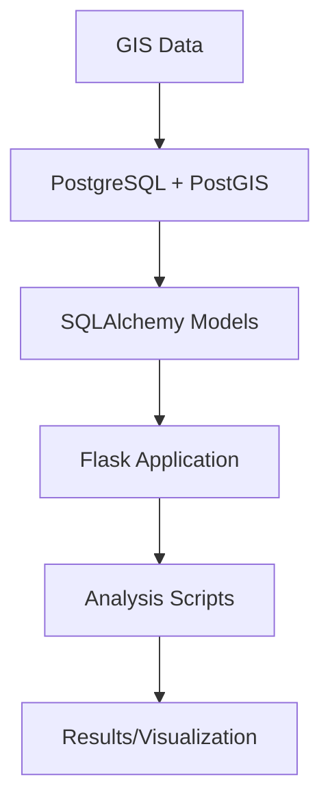

# Archestra - Site Selection Design Document

## 1. Introduction

### 1.1 Purpose
This document outlines the technical design for a site selection system that automates and optimizes the process of finding suitable locations for new developments. The system transforms a traditionally manual, time-consuming process into an efficient, data-driven workflow that considers multiple factors including spatial constraints, demographic data, and local development patterns.

### 1.2 Scope
The system encompasses:
Project requirement specification and validation
Automated site search across multiple GIS datasets
Development conditions analysis
Data persistence across analysis runs
Visualization of results
Out of scope:
Real-time data updates from external sources
User authentication and authorization
Multi-user concurrent access
Cost estimation and financial analysis
Construction planning

## 2. Goals and Objectives

### 2.1 Functional Requirements

#### 2.1.1 Space Programming
- Accept and validate user inputs for project requirements
  - Version tracking for requirements
- Calculate required Gross Floor Area (GFA) range
- Calculate and save space programming requirements into a csv file

#### 2.1.2 Site Search
- Apply site filtering based on hard constraints:
  - Plot size validation
  - Shape index calculation
  - Existing building checks
  - Road access verification
- Calculate and normalize site metrics
- Generate weighted site scores
- Persist calculation results for future reference

#### 2.1.3 Development Conditions Analysis
- Analyze neighborhood development patterns
- Calculate key development conditions (based on neighborhood development patterns):
  - Maximum Building Coverage Ratio (BCR)
  - Maximum Floor Area Ratio (FAR)
  - Maximum building height
  - Maximum front width
  - Road setback requirements
- Compare site conditions with project requirements
- Generate compliance warnings

#### 2.1.4 Visualization
- Generate overview maps of candidate sites
- Provide detailed site-specific visualizations
- Display development metrics and analysis results
- Support interactive site selection

### 2.2 Non-Functional Requirements

#### 2.2.1 Performance
- Site search operations completed within 60 seconds for standard dataset sizes
- Development condition analysis completed within 30 seconds per site
- Database query response time under 2 seconds for standard queries
- Support datasets up to 100,000 plots and 500,000 buildings

#### 2.2.2 Data Persistence
- Maintain data integrity across analysis runs
- Track data versions and calculation timestamps
- Support incremental updates to base datasets
- Ensure ACID compliance for database operations

#### 2.2.3 Scalability
- Support multiple geographic regions
- Handle increasing dataset sizes efficiently
- Allow for addition of new analysis criteria
- Support future multi-user access

#### 2.2.4 Usability
- Clear visualization of analysis results
- Intuitive parameter input interfaces
- Comprehensive error messages and warnings
- Reproducible analysis results

## 3. System Overview

### 3.1 System Context
Archestra is a Python-based application that automates the process of finding and evaluating suitable locations for real estate developments. It integrates spatial data processing with domain-specific analysis to transform raw GIS data into actionable site recommendations.

The system operates in three main phases:
1. **Programming Phase**: Captures and validates project requirements
2. **Site Search Phase**: Identifies and scores candidate sites
3. **Development Analysis Phase**: Evaluates detailed site conditions

### 3.2 Key Features

#### 3.2.1 Persistent Spatial Database
- Centralized storage of GIS datasets
- Precalculated site metrics and scores
- Version tracking of data and calculations
- Efficient spatial querying capabilities

#### 3.2.2 Automated Site Evaluation
- Multi-criteria site filtering
- Vectorized spatial operations for performance
- Weighted scoring system
- Configurable evaluation parameters

#### 3.2.3 Development Pattern Analysis
- Neighborhood context evaluation
- Building regulation compliance checking
- Automated frontage analysis
- Development metrics calculation

## 4. Architecture Design

### 4.1 High-Level Architecture



### 4.2 Component Breakdown

#### 4.2.1 Data Layer
1. **Flask SQLAlchemy Models**
```python
class Site(db.Model):
    __tablename__ = 'sites'
    
    id = db.Column(db.Integer, primary_key=True)
    geometry = db.Column(Geometry('POLYGON'))
    area = db.Column(db.Float)
    shape_index = db.Column(db.Float)
    metrics = db.Column(JSONB)
    development_conditions = db.Column(JSONB)
    last_calculated = db.Column(db.DateTime)
    data_version = db.Column(db.Integer)
    
    buildings = db.relationship('Building', back_populates='site')

class Building(db.Model):
    __tablename__ = 'buildings'
    
    id = db.Column(db.Integer, primary_key=True)
    site_id = db.Column(db.Integer, db.ForeignKey('sites.id'))
    geometry = db.Column(Geometry('POLYGON'))
    function = db.Column(db.String)
    height = db.Column(db.Float)
    stories = db.Column(db.Integer)
    front_width = db.Column(db.Float)
    
    site = db.relationship('Site', back_populates='buildings')
```

3. **Site Repository**
```python
class SiteRepository:
    def get_sites(self, filters): ...
    def update_metrics(self, site_id, metrics): ...
    def get_site_buildings(self, site_id): ...
```

#### 3.2.2 Analysis Scripts
```python
def find_suitable_sites(requirements, repository): ...
def analyze_development_conditions(site): ...
def calculate_metrics(site): ...
```

### 3.3 Data Structures

#### metrics JSON
```json
{
    "local_plan": {
        "value": true,
        "plan_id": "LP123"
    },
    "road_access": {
        "value": true,
        "road_id": "R456"
    },
    "buildings": {
        "exists": true,
        "count": 2
    },
    "frontage": {
        "width": 25.5
    }
}
```

#### development_conditions JSON
```json
{
    "setback": 5.0,
    "far": 1.2,
    "bcr": 0.4,
    "front_width": 20.0,
    "height": 12.0
}
```

#### 4.2.2 Flask Application Structure
```
app/
├── __init__.py
├── services/
│   ├── programming.py
│   ├── site_search.py
│   └── development_conditions.py
├── routes/
│   └── api.py
├── site_repository.py
├── models.py
└── extensions.py
```

#### 4.2.3 Example JSON Structures

1. **metrics** JSON:
```json
{
    "local_plan": {
        "value": true,
        "plan_id": "LP123"
    },
    "road_access": {
        "value": true,
        "road_id": "R456",
        "distance": 0.0
    },
    "buildings": {
        "exists": true,
        "count": 2,
        "total_area": 150.5
    },
    "frontage": {
        "width": 25.5,
        "road_id": "R456"
    }
}
```

2. **development_conditions** JSON:
```json
{
    "setback": 5.0,
    "far": 1.2,
    "bcr": 0.4,
    "front_width": 20.0,
    "height": 12.0,
    "analysis_metadata": {
        "calculated_at": "2024-01-20T10:00:00Z",
        "analyzed_plots": ["plot_123", "plot_124", "plot_125"],
        "radius": 200
    }
}
```

### 4.3 Component Interactions

#### 4.3.1 Flask Routes Example
```python
@app.route('/api/sites', methods=['GET'])
def get_sites():
    filters = request.args.to_dict()
    repository = SiteRepository(db)
    sites = repository.get_sites(filters)
    return jsonify([site.to_dict() for site in sites])

@app.route('/api/sites/<int:site_id>/analyze', methods=['POST'])
def analyze_site(site_id):
    repository = SiteRepository(db)
    site = repository.get_sites({'id': site_id})[0]
    
    metrics = analyze_development_conditions(site)
    repository.update_development_conditions(site_id, metrics)
    
    return jsonify({'status': 'success'})
```

#### 4.3.3 Key Design Principles
1. Keep data operations in PostGIS simple and efficient
2. Perform complex calculations in Python using GeoPandas
3. Minimize database complexity
4. Use pure functions for analysis steps
5. Cache expensive calculations in the database

## 5. Implementation Plan

### 5.1 Dependencies
- PostgreSQL 13+ with PostGIS 3+
- Python 3.8+
- Flask
- SQLAlchemy with GeoAlchemy2
- GeoPandas

### 5.2 Development Phases
1. Database setup and data import
2. Core analysis functions
3. Flask application development
4. Testing and optimization